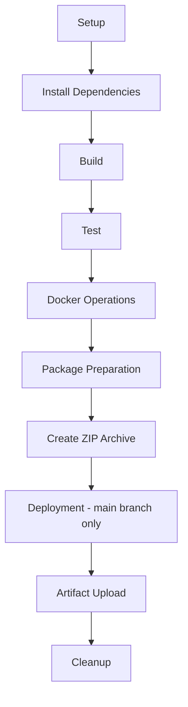

# dbk-oidc-sso-features-toolkit Overview

This `README.md` provides a high-level overview of the project structure, its intent, and the role of each directory and component. This documentation is intended to help developers, DevOps engineers, and stakeholders understand the layout and purpose of each part of the repository.

---

## dbk-oidc-sso-features-toolkit Directories

```
dbk-oidc-sso-features-toolkit/
├── .github/
├── client-web-app/
├── dist/
├── documentation/
├── sample-web-app/
├── scripts/
└── sso-validator/
```

---

## Directory Descriptions

### .github/
Contains CI/CD pipeline configurations and GitHub Actions workflows. This automates testing, building, and deployment processes.

### client-web-app/
The client-facing web application. It serves as the entry point for user requests and interactions with the system.

### dist/
Holds the final output of the entire project. This includes a ZIP archive(`oidc-sso-feature-toolkit.zip`) that is delivered to clients for local deployment and execution.
- #### oidc-sso-feature-toolkit.zip
```
dbk-oidc-sso-features-toolkit/
├── sample-web-app
    ├── frontend/
    ├── backend/
    ├── README.md
    ├── Dockerfile
    └── scripts/
        ├──init.sh
        ├──run-web-app.sh
        └──selftest.sh
├── documentation/
└── README.md
```

### documentation/
Contains all project-related documentation, excluding the main `README.md`. This may include architecture diagrams, API references, setup guides, and other technical documents.

### sample-web-app/
A complete web application that includes both frontend and backend modules. This serves as a reference implementation for the overall system.

### scripts/
Utility scripts to:
- Local Build in order to generate zip
- Create Docker images
- Containerize the application
- Run health checks on the deployed system

These scripts streamline local development and deployment workflows.

### sso-validator/
A module responsible for validating Single Sign-On (SSO) flows and ensuring secure authentication across integrated services.

---

#### Pipeline Overview

