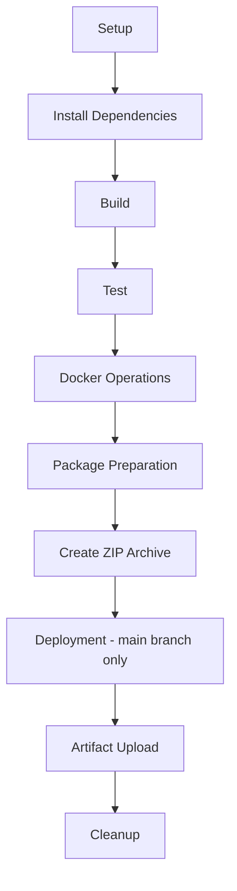

## dbk-oidc-sso-features-toolkit Overview
 
The OIDC Toolkit provides a complete local environment for testing and validating OpenID Connect (OIDC) Single Sign-On (SSO) flows. It simulates key components of Candescent OIDC flow and allows users to securely integrate, test, and validate authentication workflows.
Components:
Frontend:
•   Displays generated client credentials (client_id, client_secret, created_at).
•   Allows downloading metadata (metadata.json) and JWKS files.
•   Validates and decodes ID Tokens to securely display user information.
Backend:
•   Generates client credentials with a short-lived expiry.
•   Manages key pairs (RSA public/private keys).
•   Signs ID Tokens using RSA.
•   Exposes JWKS for token verification.

## client-web-app Overview

The `client-web-app` is a separate NestJS-based service that acts as the client-facing entry point for OIDC SSO feature validation.  
It orchestrates calls to the OIDC toolkit, validates tokens and metadata, and exposes simple APIs that downstream applications can use to test and integrate OIDC SSO flows.

## Technologies Used

### Frontend (`sample-web-app/frontend`)
- **Framework**: React (Create React App)
- **Language**: TypeScript
- **State Management**: Redux Toolkit (`@reduxjs/toolkit`, `react-redux`)
- **Routing**: React Router (`react-router-dom`)
- **Styling**: CSS modules and standard CSS
- **Testing**: Jest, React Testing Library (`@testing-library/react`, `@testing-library/jest-dom`)

### Backend (`sample-web-app/backend`)
- **Framework**: NestJS (Node.js)
- **Language**: TypeScript
- **Build & Runtime**: Node.js + npm
- **Validation & Transformation**: `class-validator`, `class-transformer`
- **Security / Tokens**: `jsonwebtoken`, RSA key handling for signing ID Tokens
- **Testing**: Jest, Supertest

### client-web-app (`client-web-app`)
- **Framework**: NestJS (Node.js)
- **Language**: TypeScript
- **Configuration**: `@nestjs/config` for environment and configuration management
- **HTTP / Integration**: `@nestjs/axios` and `rxjs` for calling external OIDC toolkit endpoints
- **Validation & Transformation**: `class-validator`, `class-transformer`
- **Security / Token Handling**: `jose` for working with JWTs and JWK/JWKS
- **Testing**: Jest and Supertest

## Clone the Project

Use the following steps to clone the repository locally:

```bash
git clone https://github.com/dfh-digital-insight/dbk-devex-oidc-sso-toolkit.git
cd dbk-devex-oidc-sso-toolkit-main
```

## Running the Sample Web App (Backend + Frontend)

The sample application contains both the backend (NestJS) and frontend (React).

### Prerequisites

- **Node.js**: Install a recent LTS version of Node.js.
- **npm**: Comes bundled with Node.js.

###  Start the Backend Server

Open a terminal and run:

```bash
cd sample-web-app/backend
npm install
npm run start:dev
```

This starts the NestJS backend server in watch mode. The default port is defined inside the backend application (commonly `http://localhost:9000` unless configured otherwise).

###  Start the Frontend Server

Open a new terminal window and run:

```bash
cd sample-web-app/frontend
npm install
npm start
```

The frontend React app will start on `http://localhost:8000` (as configured in the `start` script).

Once both servers are running:
- Access the **frontend** in your browser at `http://localhost:8000`.
- The frontend will communicate with the **backend** to generate client credentials, download metadata, and perform OIDC-related operations.

## Initialization and Usage Flow
 
### Initialization:
 
####    Generate Client Credentials
•   On loading the Home Page, the frontend automatically calls the backend API.
•   The backend generates client credentials and returns them to the frontend.
•   Credentials are displayed on the home page. The page refreshes automatically after 5 minutes to fetch new credentials.
#### Download Metadata
•   Click the Metadata button to download metadata.json.
•   The file contains redirect URIs, endpoints, scopes, and other OIDC configuration details.
####    Download JWKS
•   Clicking the JWKS button downloads the JSON Web Key Set, containing RSA public key parameters (n and e) for token verification.
•   A success message confirms the download.
 
### Token Validation and User Info:
• After authentication, the frontend shows the ID Token payload.
 
• Decode the ID Token on jwt.io  
 
• Validate the following fields in the ID Token to ensure integrity and correctness: issued at (iat), expiry (exp), issuer, subject (sub), audience (aud), email, birthday, given name, family name, phone number, preferred username.
 

 
## dbk-oidc-sso-features-toolkit Directories
 
```
dbk-oidc-sso-features-toolkit/
├── .github/
├── client-web-app/
├── dist/
├── documentation/
├── sample-web-app/
├── scripts/
```
 
---
 
## Directory Descriptions
 
### .github/
Contains CI/CD pipeline configurations and GitHub Actions workflows. This automates testing, building, and deployment processes.
 
### client-web-app/
The client-facing web application. It serves as the entry point for user requests and interactions with the system.
 
### dist/
Holds the final output of the entire project. This includes a ZIP archive(`oidc-sso-feature-toolkit.zip`) that is delivered to clients for local deployment and execution.
- #### oidc-sso-feature-toolkit.zip
```
dbk-oidc-sso-features-toolkit/
├── sample-web-app
    ├── frontend/
    ├── backend/
    ├── README.md
    ├── Dockerfile
    ├──  scripts/
        ├── ps/
            ├──init.ps1
            ├──run-web-app.ps1
            └──selftest.ps1
        ├── shell/
            ├──init.sh
            ├──run-web-app.sh
            └──selftest.sh
├── documentation/
└── README.md
```
 
### documentation/
Contains all project-related documentation, excluding the main `README.md`. This may include architecture diagrams, API references, setup guides, and other technical documents.
 
### sample-web-app/
A complete web application that includes both frontend and backend modules. This serves as a reference implementation for the overall system.
 
### scripts/
Utility scripts to:
- Local Build in order to generate zip
- Create Docker images
- Containerize the application
- Run health checks on the deployed system
 
These scripts streamline local development and deployment workflows.
 
---
 
#### Pipeline Overview
 

 